# Manual KYB Prosper — Recorrido de verificación

> **Objetivo del documento**: contexto de referencia para que Claude
> arme un manual paso a paso para el usuario final (cliente y
> analista). Incluye:
> - Captura de cada pantalla con nombre estable y descripción de lo
>   que muestra.
> - El orden real del flujo de verificación (cliente → analista →
>   super_admin).
> - Endpoints, roles, controles y precauciones que un usuario real
>   necesita conocer.
> - Estado del entorno preview donde se tomaron las capturas.
>
> Las capturas viven en `screenshots/` junto a este archivo. Si se
> vuelve a correr `_take_screenshots.py`, los nombres son
> deterministas y las mismas rutas se sobreescriben.

---

## Índice

1. [Contexto y URLs](#contexto-y-urls)
2. [Roles y usuarios](#roles-y-usuarios)
3. [Recorrido del cliente](#recorrido-del-cliente)
4. [Recorrido del analista de Compliance](#recorrido-del-analista-de-compliance)
5. [Configuración super_admin](#configuración-super_admin)
6. [Cosas que el manual debería explicar sí o sí](#cosas-que-el-manual-debería-explicar-sí-o-sí)
7. [Fuera de alcance en esta fase](#fuera-de-alcance-en-esta-fase)

---

## Contexto y URLs

- **Preview base**:
  `https://15b54ecb-7c4d-4e40-932c-37af86d0770c.preview.emergentagent.com`
- Flags activos: `KYB_MODULE_ENABLED=true`,
  `NEXT_PUBLIC_KYB_MODULE_ENABLED=true`.
- `RESEND_API_KEY` vacía → todos los correos quedan en la colección
  `outbound_emails` con `status="preview_only"`. En preview no se
  envían mails reales.
- Módulo detrás de flags: con los flags apagados no hay pantallas ni
  rutas KYB nuevas montadas.

---

## Roles y usuarios

En el preview hay dos expedientes listos y dos usuarios internos:

| Rol                | Email                                       | Uso                                                                                        |
|--------------------|---------------------------------------------|--------------------------------------------------------------------------------------------|
| Cliente A (draft)  | `cliente-a-phase8@preview-prosper.io`       | recorrer el wizard como cliente desde cero                                                 |
| Cliente B (submitted) | `cliente-b-phase8@preview-prosper.io`    | expediente ya enviado, se abre desde el portal admin                                       |
| super_admin        | `super@prosper.foundation`                  | Compliance completo + Settings de proveedores + Modelo de riesgo + Jobs                    |
| compliance_officer | `compliance@prosper.foundation`             | Compliance sin acceso a Settings                                                           |

Login por magic link:
`{base}/api/v1/auth/dev-login?email=<email>&next=<path>`

---

## Recorrido del cliente

### 1. Bienvenida al wizard — Identificación tributaria
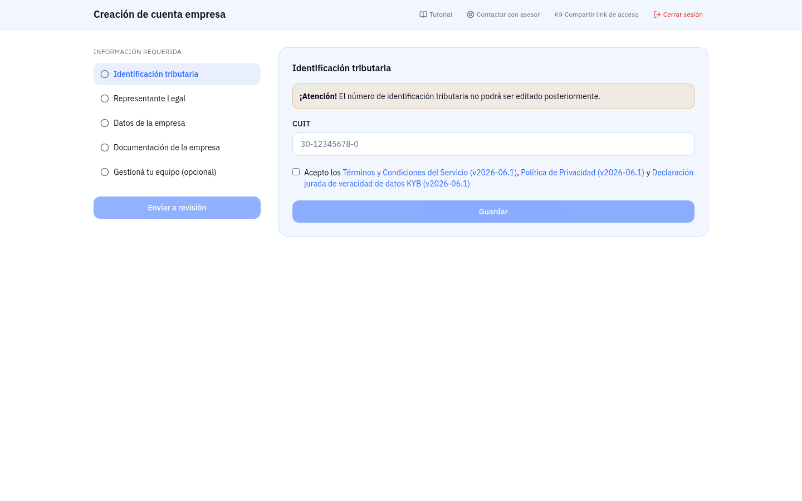

- Cinco secciones a la izquierda:
  1. Identificación tributaria
  2. Representante Legal
  3. Datos de la empresa
  4. Documentación de la empresa
  5. Gestioná tu equipo (opcional)
- Cabecera con **cuatro acciones**: Tutorial, Contactar con asesor,
  Compartir link de acceso, Cerrar sesión.
- La sección Identificación tributaria advierte que el CUIT no puede
  editarse una vez guardado.
- Documentos legales que el cliente acepta: TyC, Privacidad y
  Declaración jurada de veracidad de datos KYB.
- El botón **Enviar a revisión** está deshabilitado hasta que las 4
  primeras secciones estén completas.

### 2. Sección Equipo — colapsada
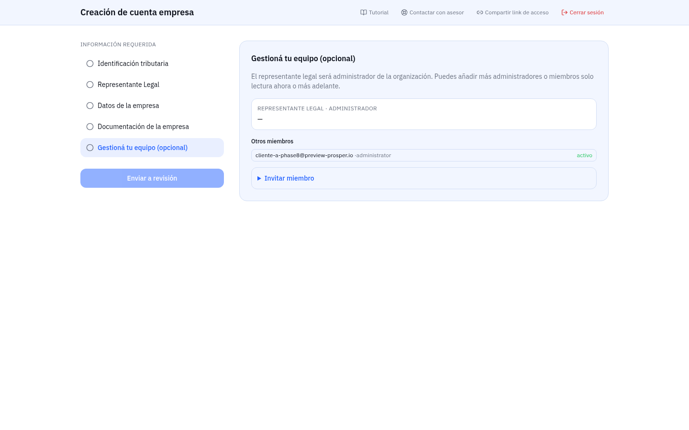

- Banner obligatorio: *"El representante legal será administrador de
  la organización. Puedes añadir más administradores o miembros solo
  lectura ahora o más adelante."*
- Bloque destacado "REPRESENTANTE LEGAL · ADMINISTRADOR".
- Bloque "Otros miembros" — arranca con el admin actual como único
  activo.
- Botón `Invitar miembro` colapsado por defecto (no se rompe la
  pantalla con un formulario si no lo van a usar).

### 3. Sección Equipo — formulario de invitación expandido
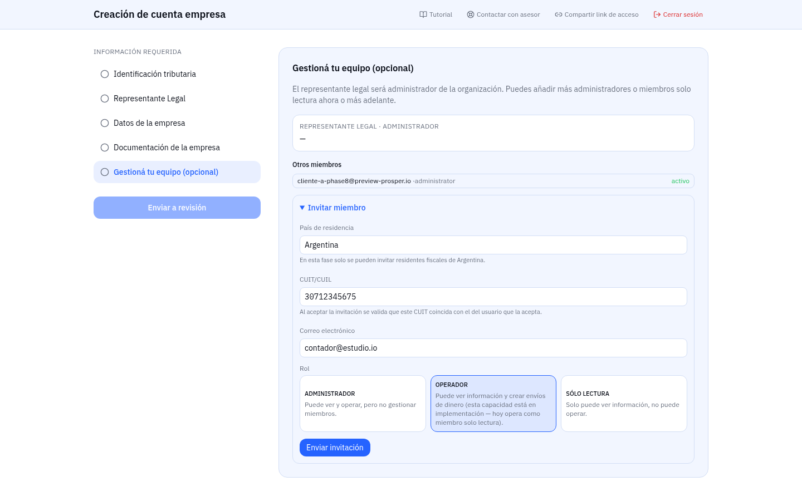

- **País de residencia**: solo Argentina en esta fase (input
  deshabilitado con la aclaración).
- **CUIT/CUIL**: nota crítica bajo el campo: *"Al aceptar la
  invitación se valida que este CUIT coincida con el del usuario
  que la acepta."* Es el control anti-hijack.
- **Correo electrónico** del invitado.
- **Rol** en tres tarjetas seleccionables:
  - `ADMINISTRADOR` — Puede ver y operar, pero no gestionar miembros.
  - `OPERADOR` — Puede ver información y crear envíos de dinero.
    Con aclaración: *"esta capacidad está en implementación — hoy
    opera como miembro solo lectura"*. (Es la promesa alineada con el
    backend actual.)
  - `SÓLO LECTURA` (default) — Solo puede ver información, no puede
    operar.
- Botón `Enviar invitación` habilitado sólo cuando el CUIT tiene 11
  dígitos y el email es válido.

### 4. Compartir enlace de acceso — modal vacío
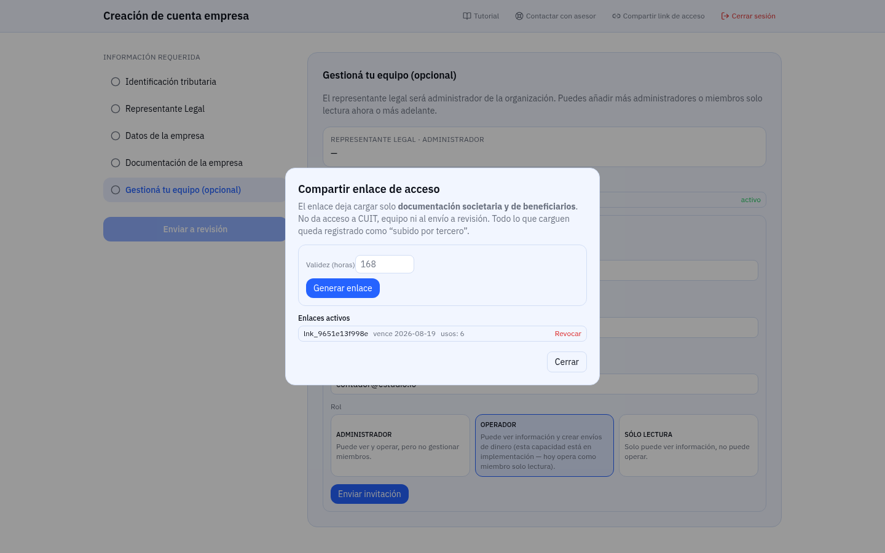

- Explica claramente qué permite el enlace: **solo carga de
  documentación** societaria y de beneficiarios. No da acceso a CUIT,
  equipo ni envío a revisión.
- Todo lo que suba un tercero queda marcado como "subido por
  tercero" (evidencia de auditoría).
- Se elige Validez en horas (default 168 = 7 días, máximo 720).

### 5. Enlace creado
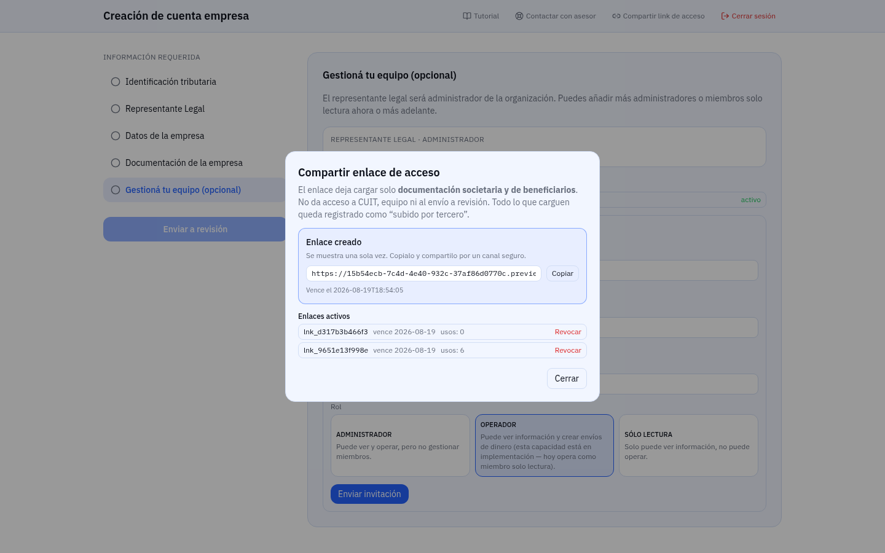

- Aviso explícito: *"Se muestra una sola vez. Copialo y compartilo
  por un canal seguro."*
- URL + botón Copiar.
- Vencimiento visible.
- Debajo, "Enlaces activos" lista los tokens vigentes con
  `link_id`, vencimiento, cantidad de usos y opción de **Revocar**.

### 6. Página pública del tercero (sin sesión)
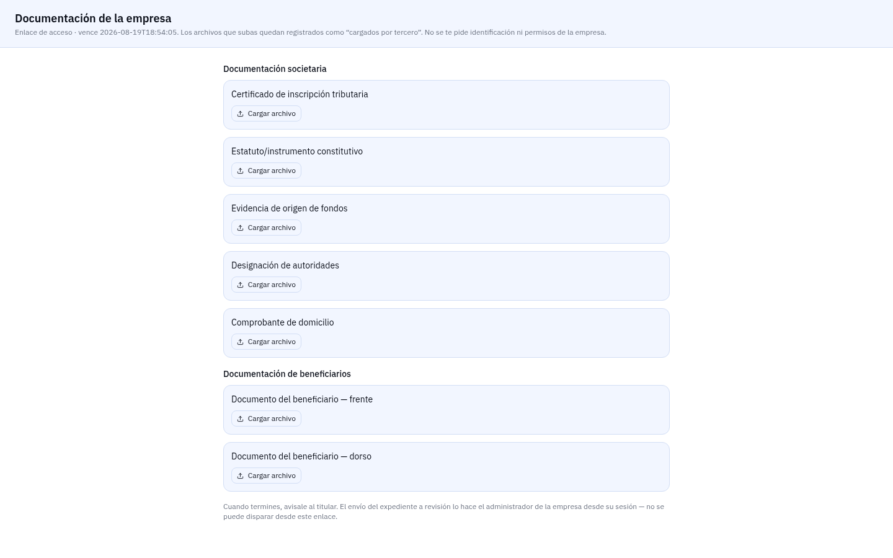

- Header con la vigencia del enlace: *"Los archivos que subas quedan
  registrados como 'cargados por tercero'. No se te pide
  identificación ni permisos de la empresa."*
- Cards por slot documental:
  - Documentación **societaria** (5 slots):
    - Certificado de inscripción tributaria
    - Estatuto/instrumento constitutivo
    - Evidencia de origen de fondos
    - Designación de autoridades
    - Comprobante de domicilio
  - Documentación **de beneficiarios** (2 slots por UBO):
    - Documento del beneficiario — frente
    - Documento del beneficiario — dorso
- Nota final: *"El envío del expediente a revisión lo hace el
  administrador de la empresa desde su sesión — no se puede disparar
  desde este enlace."*

### 7. Aceptación pública de invitación de equipo
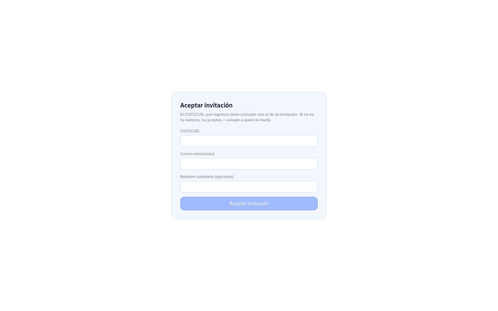

- Nota clave: *"El CUIT/CUIL que ingreses debe coincidir con el de la
  invitación. Si no es tu número, no aceptes."*
- 3 campos: CUIT/CUIL, Correo electrónico, Nombre completo (opcional).
- Al submitir con CUIT o email distinto al invitado, el backend
  responde 403 con auditoría `reason=tax_id_mismatch` /
  `email_mismatch`.

---

## Recorrido del analista de Compliance

### 8. Bandeja de casos
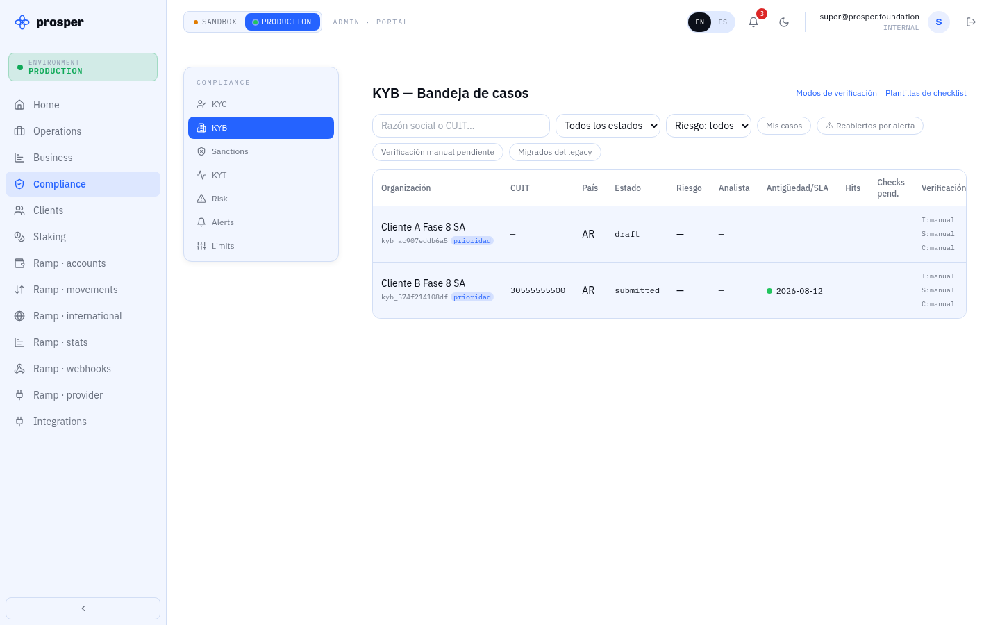

- Filtros: búsqueda por razón social/CUIT, estado, riesgo, "Mis
  casos", "Reabiertos por alerta", "Verificación manual pendiente",
  "Migrados del legacy".
- Columnas: Organización, CUIT, País, Estado, Riesgo, Analista,
  Antigüedad/SLA, Hits, Checks pendientes, Verificación (I/S/C =
  identity/screening/company_registry).
- Marca SLA con puntos: verde/ámbar/rojo según `KYB_SLA_HOURS`
  (default 72).
- En la cabecera: enlaces a **Modos de verificación** y **Plantillas
  de checklist** (super_admin).

### 9. Detalle — tab Expediente (default)
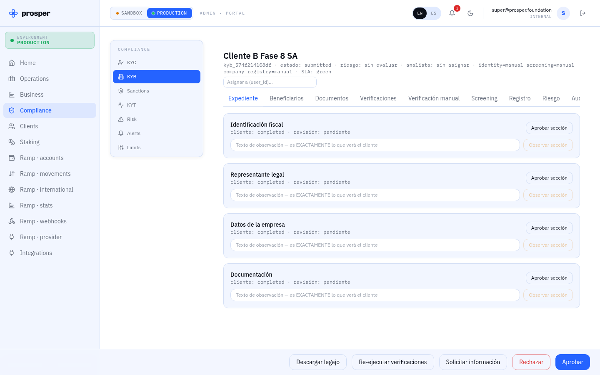

- Título con nombre de la empresa + case_id + metadatos: estado,
  riesgo, analista, verificación por categoría, SLA.
- Campo "Asignar a (user_id)" para reasignar.
- **9 tabs**: Expediente · Beneficiarios · Documentos · Verificaciones
  · Verificación manual · Screening · Registro · Riesgo · Auditoría.
- Cada sección del cliente muestra estado del cliente + estado de
  revisión pendiente/aprobada/observada.
- Textarea con placeholder: *"Texto de observación — es EXACTAMENTE lo
  que verá el cliente"* + botón `Observar sección`. Recordatorio de
  que la observación viaja al cliente palabra por palabra.
- Barra inferior fija con las acciones principales:
  **Descargar legajo · Re-ejecutar verificaciones · Solicitar
  información · Rechazar · Aprobar**.

### 10. Detalle — Beneficiarios
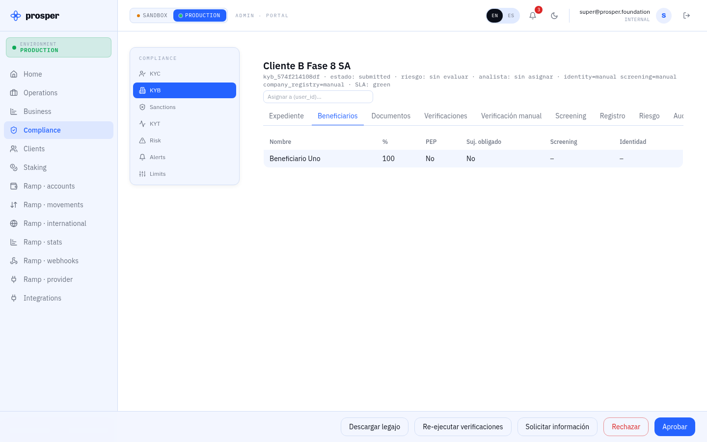

- Tabla: Nombre, %, PEP, Sujeto obligado, Screening, Identidad.
- Cliente B tiene un solo UBO al 100%, no PEP.

### 11. Detalle — Documentos
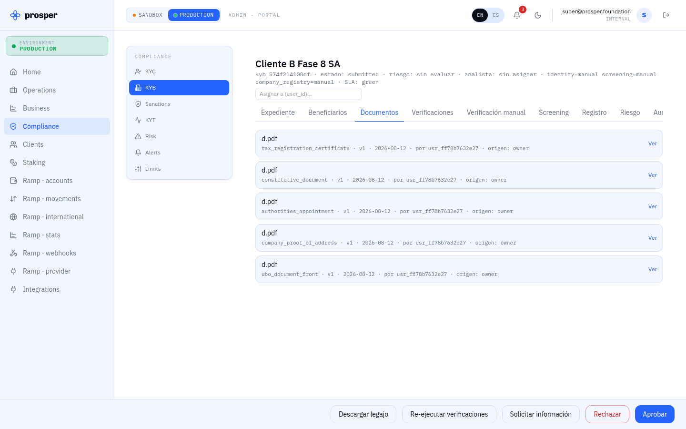

- Cinco documentos vigentes (cliente B trae 4 societarios + 1 UBO
  front).
- Cada fila: nombre archivo, slot, versión, fecha, quien subió,
  **origen** (`owner` vs `shared_link` — evidencia de trazabilidad).

### 12. Detalle — Verificaciones (proveedores)
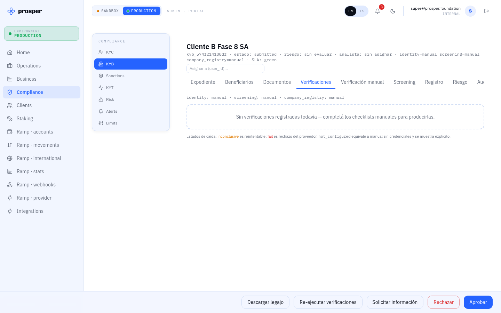

- Vista de las verificaciones normalizadas por proveedor. Con Sumsub
  postergado, la tab muestra el estado "manual" para las tres
  categorías.

### 13. Detalle — Verificación manual (checklists)
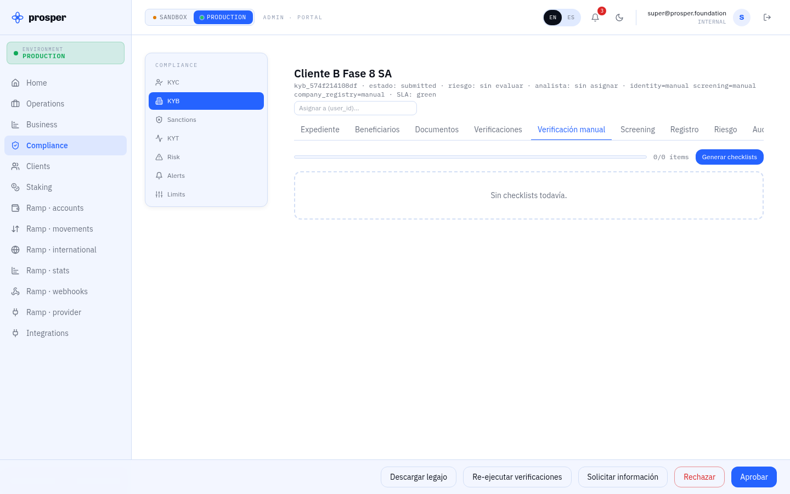

- Estado: "Sin checklists todavía" + botón `Generar checklists`.
- Al generar, se crean checklists por categoría × sujeto según los
  templates activos (identity, screening, company_registry).
- Cada ítem tiene outcome (`clear` / `hit` / `unable_to_verify`),
  notas y evidencia opcional o requerida.
- Marker-checker: quien completó un ítem no puede aprobar el caso
  después (403). Override sólo super_admin.

### 14. Detalle — Screening
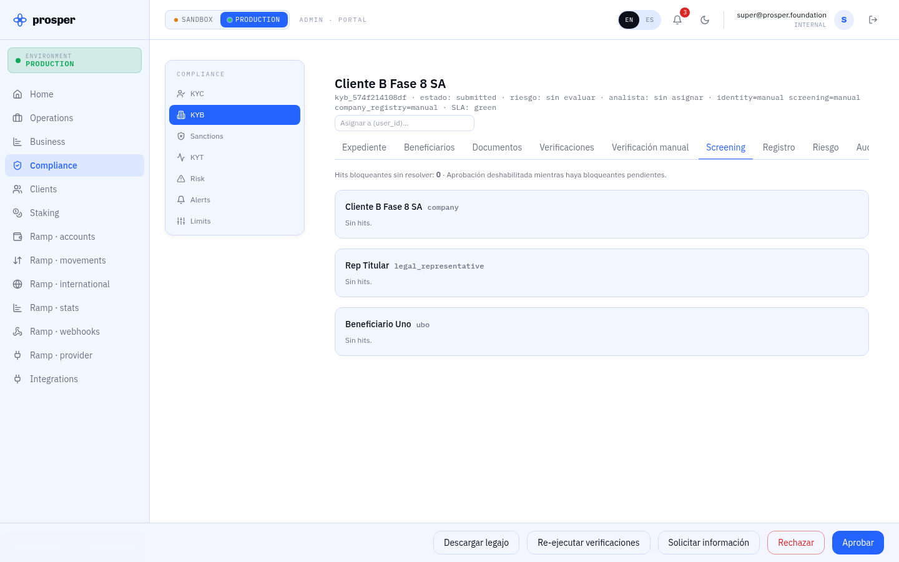

- Grupos por sujeto: **Empresa · Representante legal · cada UBO**.
- Cada hit muestra: tipo de lista, nombre de la lista, nombre
  coincidente, score, fuente (`provider` o `manual`), badge
  `bloqueante` en rojo cuando aplica, badge extra
  "detectado tras aprobación" para vigilancia continua.
- Resolución individual con nota ≥ 20 caracteres:
  - **Coincidencia real** — el hit deja de bloquear la aprobación
    pero el caso NO se rechaza automáticamente. La decisión sigue
    siendo humana.
  - **Falso positivo** — deja de bloquear con motivo auditado.
- Los hits con `source=provider` propagan la resolución con el
  proveedor. Si la propagación falla, se reintenta en segundo plano;
  la resolución local se conserva. Los hits `source=manual` no se
  propagan.
- Botones extra para promover/demote bloqueo manualmente (motivo ≥
  10 caracteres, auditado).
- Contador "Hits bloqueantes sin resolver: N" arriba: mientras N > 0
  el botón Aprobar queda deshabilitado.

### 15. Detalle — Registro
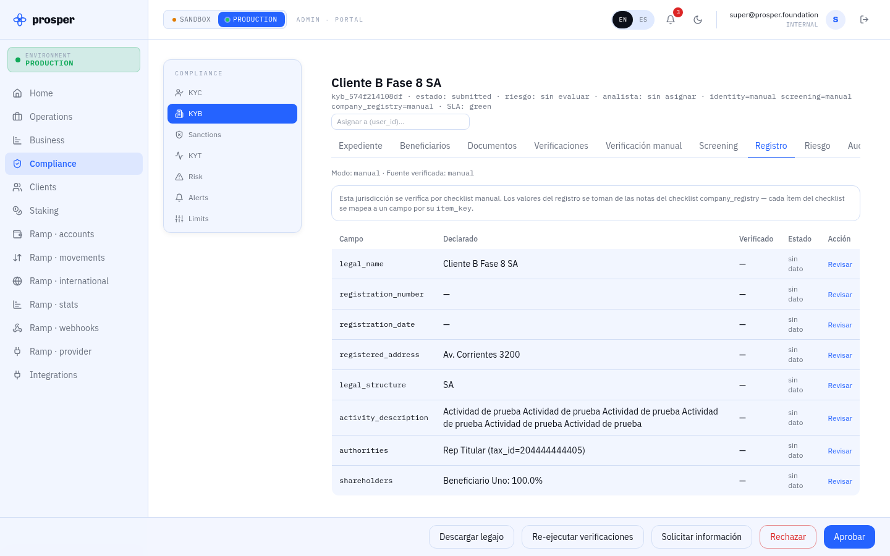

- Vista campo por campo: **Declarado** ↔ **Verificado** ↔ **Estado** ↔
  **Acción**.
- Banner "Modo: manual" cuando la jurisdicción no tiene cobertura
  automática. Nunca aparece como error ni bandera roja.
- Campos comparados: `legal_name`, `registration_number`,
  `registration_date`, `registered_address`, `legal_structure`,
  `activity_description`, `authorities`, `shareholders`.
- Estado: `coincide` / `diferencia` / `sin dato` (según el checklist
  manual company_registry).
- Botón `Revisar` por campo abre:
  - `Aceptar diferencia` con nota (queda registrada como revisada por
    el analista).
  - `Observar al cliente` con nota → se agrega automáticamente a la
    observación de la sección correspondiente del wizard del cliente.

### 16. Detalle — Riesgo
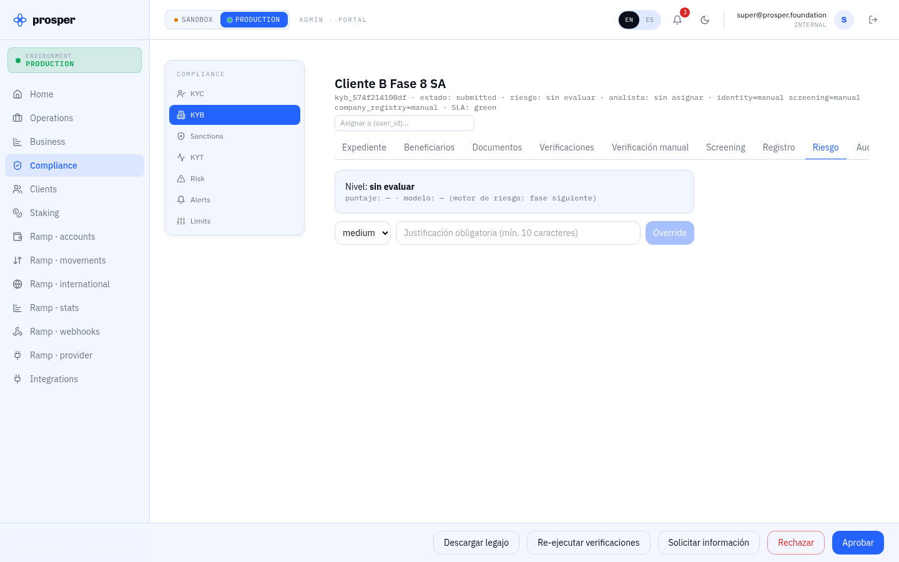

- Muestra `risk.level` + `score` + desglose por factor + versión del
  modelo con que se calculó (`model_version`) para trazabilidad.
- Los factores con peso configurable viven en Settings → Modelo de
  riesgo.

### 17. Detalle — Auditoría
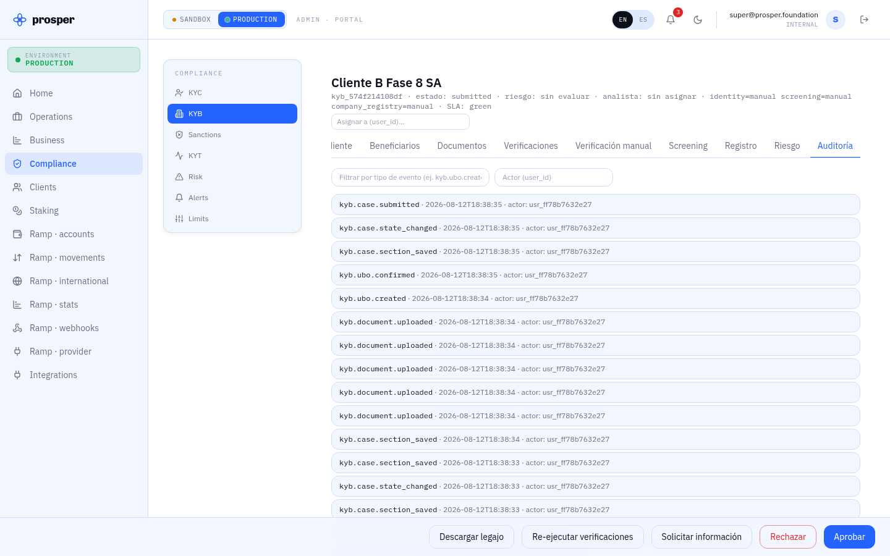

- Log completo del expediente, ordenado por fecha descendente.
- Cada evento: `action`, actor, timestamp, metadata.
- Fase 8 sumó eventos como `kyb.shared_link.created`,
  `kyb.team.invitation_created`, `kyb.team.invitation_accepted`,
  `kyb.hit.resolved`, `kyb.case.registry_field_observed`, etc.

---

## Configuración super_admin

### 18. Settings — Proveedores de verificación
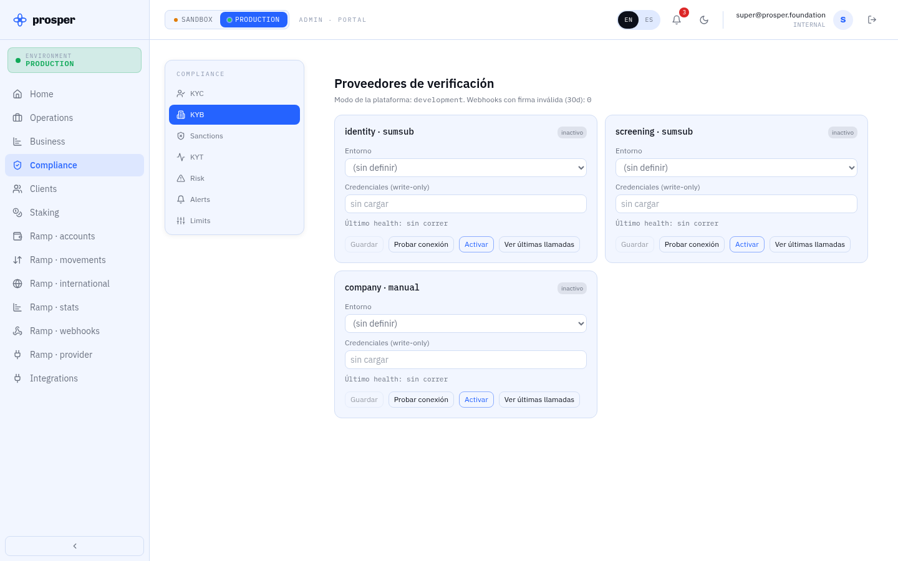

- Muestra el modo de la plataforma (dev/sandbox/production) y el
  contador de webhooks con firma inválida (últimos 30 días).
- Una tarjeta por proveedor: `identity · sumsub`, `screening ·
  sumsub`, `company · manual`.
- Cada tarjeta: Entorno (sandbox/production), Credenciales
  **write-only** (nunca se devuelve el texto en claro, sólo `last4`),
  Probar conexión (health-check con latencia + deriva de reloj),
  Activar/Desactivar.
- **Gate crítico**: en `production` el botón Activar queda
  deshabilitado hasta pasar un health-check exitoso. Al confirmar la
  activación se muestra un modal explícito:
  *"los expedientes nuevos usarán verificación automática para esta
  categoría; los casos en curso conservan su modo"*.

### 19. Settings — Modelo de riesgo
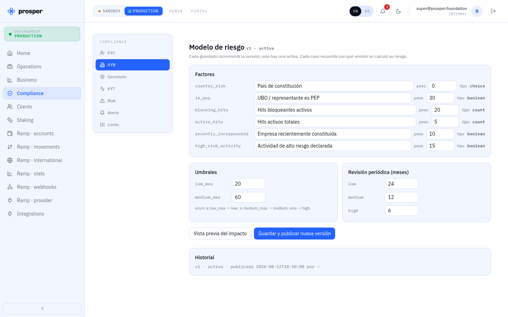

- Muestra `v{N} · activa` — cada Save publica una nueva versión y
  desactiva la anterior. Cada caso guarda con qué versión se evaluó.
- **6 factores** editables:
  - `country_risk` (choice, país de constitución)
  - `is_pep` (boolean, algún UBO/rep es PEP)
  - `blocking_hits` (count, hits bloqueantes activos)
  - `active_hits` (count, hits activos totales)
  - `recently_incorporated` (boolean)
  - `high_risk_activity` (boolean)
- **Umbrales**: `low_max`, `medium_max`. Score ≤ low_max → `low`; ≤
  medium_max → `medium`; sino → `high`.
- **Revisión periódica** en meses por nivel (low/medium/high).
- `Vista previa del impacto` corre el modelo propuesto contra los
  casos abiertos y reporta cuántos cambiarían de nivel (sin escribir
  nada).
- `Guardar y publicar nueva versión` desactiva la actual y publica la
  nueva.
- Historial visible abajo.

### 20. Settings — Plantillas de checklist
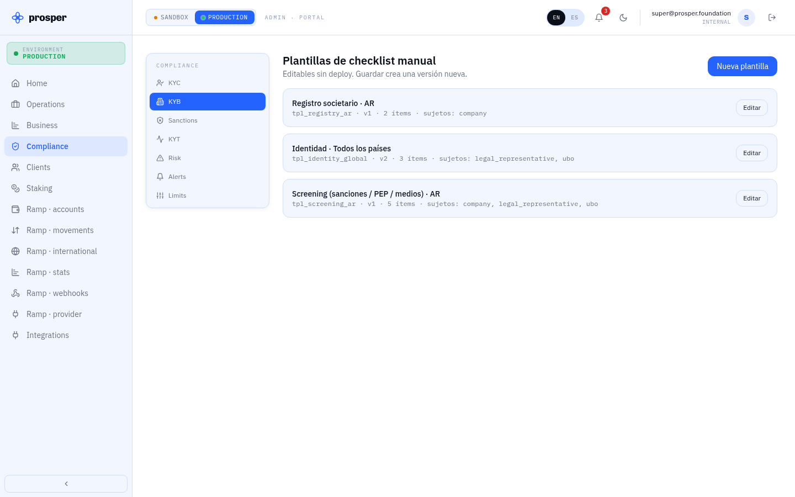

- Edición de las plantillas de verificación manual por categoría.
- Cada template tiene ítems con: `item_key`, `label`, `description`,
  `evidence_required`, `blocks_on_hit`, outcomes posibles, orden.
- Cambios crean nueva versión del template — los checklists ya
  generados conservan la versión con la que se crearon.

---

## Cosas que el manual debería explicar sí o sí

1. **Enlace compartido**
   - Los archivos cargados por terceros están marcados como tal en
     Documentos (columna Origen). No cosmético: es evidencia.
   - Revocar un enlace lo invalida inmediatamente para el tercero.
   - El titular sigue siendo el único que puede enviar a revisión.

2. **Invitación de equipo**
   - Mapeo actual: ADMINISTRADOR → `client_admin`, OPERADOR →
     `client_user` (con la aclaración "en implementación"), SÓLO
     LECTURA → `client_user`.
   - El CUIT del que acepta se valida contra el CUIT invitado. Si no
     coincide, la aceptación se rechaza con motivo auditado.

3. **Bandeja de casos**
   - SLA verde/ámbar/rojo se calcula sobre `submitted_at`.
   - Filtro "Verificación manual pendiente" ayuda a atacar backlog.
   - Filtro "Reabiertos por alerta" separa casos que volvieron a la
     bandeja tras vigilancia continua (Fase 5b futura).

4. **Aprobar / Rechazar / Solicitar información**
   - Aprobar exige: no hay hits bloqueantes sin resolver, todas las
     secciones revisadas, checklists manuales completos. Si el riesgo
     es `high`, la primera aprobación queda como "pendiente segunda
     firma" (maker-checker).
   - Rechazar exige `reason_code` tipificado + notas.
   - Solicitar información: sólo secciones con observación. El texto
     que se escribe es EXACTAMENTE lo que verá el cliente.

5. **Descargar legajo**
   - ZIP autocontenido con `case.json`, `resumen.pdf`,
     `documents/<slot>/`, `manual_evidence/<check>/<item_key>/`,
     `manual_evidence/_descartadas/`, `audit.jsonl`, `MANIFEST.txt`.
   - Diseñado para que un auditor externo entienda qué se verificó,
     cómo y quién lo hizo, sin acceso al sistema.

6. **Notificaciones**
   - Dispatcher central idempotente por
     `(event_type, case_id, recipient, discriminator)`.
   - Con `RESEND_API_KEY` vacía todo va a `outbound_emails` en
     `preview_only`. Ninguna configuración cambia cuando se active la
     key.
   - Eventos actuales: `submitted`, `info_required`, `approved`,
     `rejected`, `team.invitation`, `expiring`, `manual_check.pending`.
     `provider_alert` está construido pero no se dispara sin proveedor.

7. **Jobs**
   - Scheduler APScheduler registrado en `server.startup` sólo si el
     módulo está activo.
   - Corridas diarias: expiración por inactividad
     (`KYB_INACTIVITY_DAYS`, default 90d), aviso 7 días antes de
     expirar, checklists SLA-vencidos.
   - Endpoint `POST /admin/compliance/kyb/jobs/run-expiration` para
     forzar la corrida en preview. Devuelve **409 en producción**
     incluso para super_admin.

---

## Fuera de alcance en esta fase

- Vigilancia continua real (llega con Sumsub / Fase 5b).
- Identidad con handoff a proveedor externo.
- Comparación automática contra registro societario oficial (hoy es
  manual mientras el proveedor no exista).

---

## Reproducción de las capturas

Para regenerar las 20 imágenes de este documento:

```bash
python /app/docs/kyb/manual_kyb/_take_screenshots.py
```

Requiere los flags KYB encendidos en el preview y los dos expedientes
seed (Cliente A + Cliente B) creados. Instrucciones para prepararlos
en `/app/memory/test_credentials.md`.
